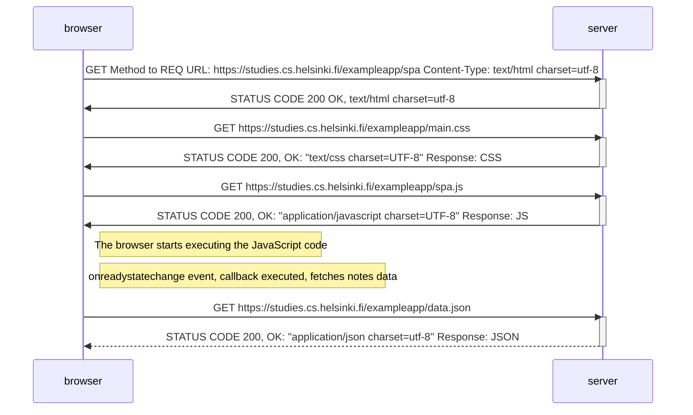

```mermaid
sequenceDiagram
participant browser
participant server

%% user visits the url: https://studies.cs.helsinki.fi/exampleapp/spa
%% fetch HTML
browser->>server: GET Method to REQ URL: https://studies.cs.helsinki.fi/exampleapp/spa Content-Type: text/html charset=utf-8
activate server
server->>browser: STATUS CODE 200 OK, text/html charset=utf-8
deactivate server

%% fetch CSS:
browser->>server: GET https://studies.cs.helsinki.fi/exampleapp/main.css
activate server
server->>browser: STATUS CODE 200, OK: "text/css charset=UTF-8" Response: CSS
deactivate server

%% fetch JS:
browser->>server: GET https://studies.cs.helsinki.fi/exampleapp/spa.js
activate server
server->>browser: STATUS CODE 200, OK: "application/javascript charset=UTF-8" Response: JS
deactivate server

Note right of browser: The browser starts executing the JavaScript code
Note right of browser: onreadystatechange event, callback executed, fetches notes data
%% js code fetches the notes data:
browser->>server: GET https://studies.cs.helsinki.fi/exampleapp/data.json
activate server
server-->>browser: STATUS CODE 200, OK: "application/json charset=utf-8" Response: JSON
deactivate server


```
