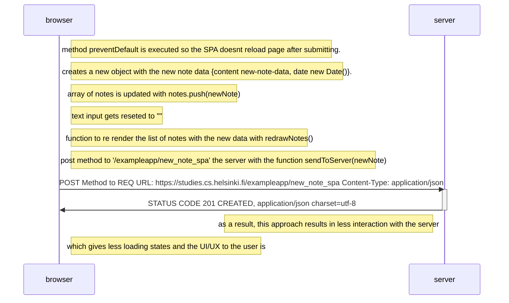

```mermaid
sequenceDiagram
participant browser
participant server

%% user writes and submits new note
%% browser executes onSubmit form event:
Note right of browser: method preventDefault is executed so the SPA doesnt reload page after submitting.
Note right of browser: creates a new object with the new note data {content new-note-data, date new Date()}.
Note right of browser: array of notes is updated with notes.push(newNote)
Note right of browser: text input gets reseted to ""
Note right of browser: function to re render the list of notes with the new data with redrawNotes()
Note right of browser: post method to '/exampleapp/new_note_spa' the server with the function sendToServer(newNote)

browser->>server: POST Method to REQ URL: https://studies.cs.helsinki.fi/exampleapp/new_note_spa Content-Type: application/json
activate server
server->>browser: STATUS CODE 201 CREATED, application/json charset=utf-8
deactivate server


Note left of server: as a result, this approach results in less interaction with the server
Note right of browser: which gives less loading states and the UI/UX to the user is

```
