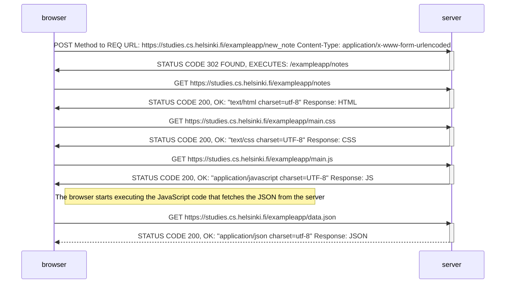

```mermaid
    sequenceDiagram
    participant browser
    participant server

    %% user writes in the text input
    %% user hits the submit button
    browser->>server: POST Method to REQ URL: https://studies.cs.helsinki.fi/exampleapp/new_note Content-Type: application/x-www-form-urlencoded
    activate server
    server->>browser: STATUS CODE 302 FOUND, EXECUTES: /exampleapp/notes
    deactivate server

    %% browser reloads
    %% fetch HTML
    browser->>server: GET https://studies.cs.helsinki.fi/exampleapp/notes
    activate server
    server->>browser: STATUS CODE 200, OK: "text/html charset=utf-8" Response: HTML
    deactivate server

    %% fetch CSS:
    browser->>server: GET https://studies.cs.helsinki.fi/exampleapp/main.css
    activate server
    server->>browser: STATUS CODE 200, OK: "text/css charset=UTF-8" Response: CSS
    deactivate server

    %% fetch JS:
    browser->>server: GET https://studies.cs.helsinki.fi/exampleapp/main.js
    activate server
    server->>browser: STATUS CODE 200, OK: "application/javascript charset=UTF-8" Response: JS
    deactivate server

    Note right of browser: The browser starts executing the JavaScript code that fetches the JSON from the server

    %% js code fetches the notes data:
    browser->>server: GET https://studies.cs.helsinki.fi/exampleapp/data.json
    activate server
    server-->>browser: STATUS CODE 200, OK: "application/json charset=utf-8" Response: JSON
    deactivate server
```
